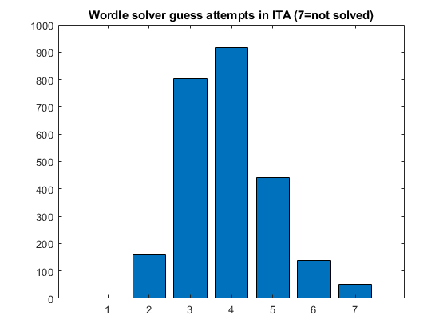
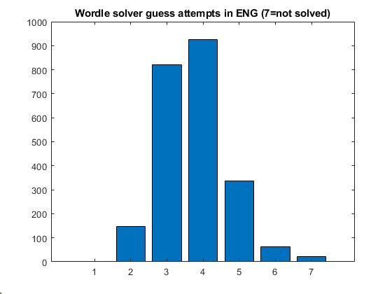

# wordle-solver
My attempt at solving wordle puzzles in HARD MODE using bayesian statistcs 

If you're even lazier, check out https://github.com/lorossi/wordle-solution


italian words taken from:
https://github.com/pietroppeter/wordle-it/blob/e490781af9ff34a0294e3c9da3a5c0941ab94a7b/wordle-it.js#L942-L943

## Performance 
```matlab
bar([1, 158, 804, 917, 442, 138,50])
title("Wordle solver guess attempts in ITA (7=not solved)")
```



```matlab
bar([1, 146, 821, 926, 336, 63,22])
title("Wordle solver guess attempts in ENG (7=not solved)")
```



## Notes for myself of the future

To run the profiler, run:

```
python -m cProfile -s tottime myscript.py
```
